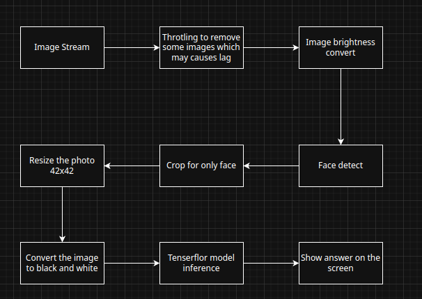
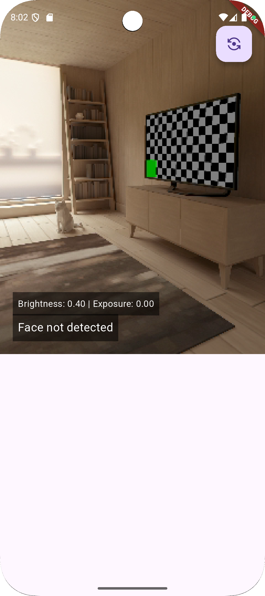

# Face Detection Pipeline (Flutter)

## Overview

This Flutter project implements a face condition detection pipeline that processes an image stream from a mobile device's camera to detect and analyze faces in real-time, across various lighting environments. The pipeline leverages the google_ml_kit package for face detection and a custom TensorFlow Lite (TFLite) model for face condition inference. It is designed to handle a continuous stream of images, optimize performance by throttling laggy frames, and display the results on the screen, even in challenging lighting conditions such as overly bright or dim environments.

The application detects a person's face and analyzes its condition, identifying states such as tiredness, stress, happiness, or sadness. It dynamically adjusts face detection to ensure accuracy and speed in all lighting scenarios. Developed in Flutter, it is compatible with both Android and iOS platforms (testing on one is acceptable, with debug info provided if issues arise on the other). This app is ideal for use cases like real-time face condition monitoring on mobile devices, user authentication, or interactive media applications requiring robust performance across diverse lighting conditions.
## Features

- Processes a live image stream from the device's camera.
- Throttles frames to reduce lag and improve performance.
- Adjusts image brightness for consistent processing.
- Resizes images to a standard 42x42 resolution for TFLite model compatibility.
- Crops images to focus on detected faces using `google_ml_kit`.
- Converts images to black and white for model inference.
- Uses a custom TFLite model for face detection inference.
- Displays the results on the screen in real-time.

## Pipeline Steps

The pipeline follows these steps to process the image stream:

1. **Image Stream Input**  
   The pipeline starts with a live image stream from the device's camera, captured using the `camera` package in Flutter.

2. **Throttling**  
   To prevent lag and ensure smooth performance, the pipeline throttles the image stream by skipping some frames that may cause delays.

3. **Image Brightness Conversion**  
   The remaining frames are processed to adjust their brightness levels to a consistent range, ensuring uniformity for downstream processing.

4. **Face Detection (Using `google_ml_kit`)**  
   The `google_ml_kit` package's face detection API is used to identify faces in the brightness-adjusted images.

5. **Resize the Photo (42x42)**  
   The images are resized to a standard resolution of 42x42 pixels to match the input requirements of the custom TFLite model.

6. **Crop for Only Face**  
   The resized images are cropped to focus solely on the detected face, using the bounding box data provided by `google_ml_kit`.

7. **Convert to Black and White**  
   The cropped images are converted to black and white to simplify the data for the TFLite model and improve inference accuracy.

8. **TFLite Model Inference**  
   A custom TensorFlow Lite model is used to perform face detection inference on the processed images.

9. **Show Answer on the Screen**  
   The results of the face detection (e.g., bounding boxes, confidence scores, or labels) are overlaid on the camera preview and displayed on the screen.



## Logic for the brightness convert

**Constants:**
- `tooBrightThreshold = 0.6`: Upper brightness limit (60% of max)  
- `tooDimThreshold = 0.3`: Lower brightness limit (30% of max)  
- `step = 0.5`: Exposure adjustment increment  

**Exposure Limits:**
- Gets minimum and maximum exposure offsets from the camera controller  

**Adjustment Logic:**
- **Too Bright (> 0.6):**  
  - Reduces exposure by `step`, respecting the minimum limit  
  - Turns off flash if it's on  
- **Too Dim (< 0.3) (only for main camera, index 0):**  
  - Increases exposure by `step`, respecting the maximum limit  
  - Turns on flash (torch mode) if it's off  
- **Normal Range:**  
  - Turns off flash if it was on  

**Apply Changes:**
- Updates exposure offset if it changed  
- Stores new value in `exposureOffset.value`  

**Error Handling:**
- Catches any errors and updates `status.value` with the error message  


## Requirements

To run this project, you will need the following:

- Flutter 3.0 or higher
- Dart 3.0 or higher
- A mobile device with a camera (for testing)
- The following Flutter packages:
  - `camera`: For accessing the device's camera.
  - `google_ml_kit`: For face detection.
  - `tflite`: For running the custom TensorFlow Lite model.
  - `image`: For image processing (resizing, cropping, and converting to black and white).

## Installation

1. Clone this repository to your local machine:

   ```bash
   git clone https://github.com/yourusername/face-detection-flutter.git
   cd facewise
   ```

2. Install the Flutter dependencies:
    ```bash
    flutter pub get
    ```

3. Add the custom TFLite model:

    Place your custom TFLite model file (e.g., `face_detection_model.tflite`) and its labels file (e.g., `labels.txt`) in the assets/ directory.

    Update the pubspec.yaml file to include the assets:
    ```bash
    flutter:
        assets:
            - assets/face_detection_model.tflite
            - assets/labels.txt
    ```

## Usage
1. Connect a mobile device or use an emulator/simulator with camera support.

2. Run the Flutter app:
```bash
flutter run
```

3. Grant camera permissions when prompted.

4. The app will start the camera, process the image stream, detect faces using google_ml_kit, run inference with the TFLite model, and display the results on the screen in real-time.


## Project Structure 

`lib/main.dart`: Entryw point of the application.

`lib/camera.dart`: Contains the UI for the home page and has the logic to detect the face using `google_ml_kit`

`lib/image_format_utils.dart`: Contains the logic to convert the image format to the bytes to following pass it to `google_ml_kit` and infered using `tenserflow model`

`lib/face_detect.dart`: Contains the logic which first get the face crop it using `google_ml_kit` and greyscale the image and get the result using tenserflow model.


## Special Thanks and Assets Usage

The TensorFlow model utilized for emotion detection is sourced from https://github.com/maelfabien/Multimodal-Emotion-Recognition. Specifically, the model employed is located within the directory `Multimodal-Emotion-Recognition/03-Video/Models/EmotionXCeption`. Many thanks to the creators for providing this valuable resource!


## How app look


## Tested
Works well on the physical device and the emulator configuration listed below.

**Physical device**
tested on `F22-128Gb-6Gb`
 

**Emulator**
```
Properties
avd.ini.displayname              Medium Phone
avd.ini.encoding                 UTF-8
AvdId                            Medium_Phone
disk.dataPartition.size          6G
fastboot.chosenSnapshotFile      
fastboot.forceChosenSnapshotBoot no
fastboot.forceColdBoot           no
fastboot.forceFastBoot           yes
hw.accelerometer                 yes
hw.arc                           false
hw.audioInput                    yes
hw.battery                       yes
hw.camera.back                   virtualscene
hw.camera.front                  webcam0
hw.cpu.ncore                     4
hw.device.hash2                  MD5:2016577e1656e8e7c2adb0fac972beea
hw.device.manufacturer           Generic
hw.device.name                   medium_phone
hw.dPad                          no
hw.gps                           yes
hw.gpu.enabled                   yes
hw.gpu.mode                      auto
hw.gyroscope                     yes
hw.initialOrientation            portrait
hw.keyboard                      yes
hw.lcd.density                   420
hw.lcd.height                    2400
hw.lcd.width                     1080
hw.mainKeys                      no
hw.ramSize                       2048
hw.sdCard                        yes
hw.sensors.light                 yes
hw.sensors.magnetic_field        yes
hw.sensors.orientation           yes
hw.sensors.pressure              yes
hw.sensors.proximity             yes
hw.trackBall                     no
image.androidVersion.api         35
image.sysdir.1                   system-images/android-35/google_apis_playstore/x86_64/
PlayStore.enabled                true
runtime.network.latency          none
runtime.network.speed            full
showDeviceFrame                  yes
skin.dynamic                     yes
tag.display                      Google Play
tag.displaynames                 Google Play
tag.id                           google_apis_playstore
tag.ids                          google_apis_playstore
vm.heapSize                      228
```